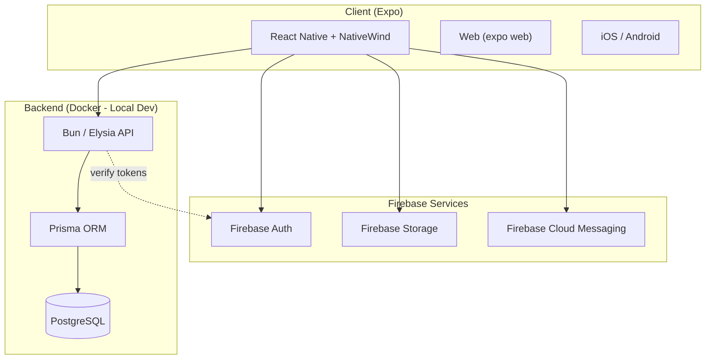

# Tech Stack

## Client
- **Framework:** Expo 54 (React Native + Web)
- **Language:** TypeScript
- **Styling:** NativeWind (Tailwind CSS)
- **Runtime:** Bun

## Backend
- **Runtime:** Bun
- **Framework:** Elysia
- **ORM:** Prisma
- **Database:** PostgreSQL

## Firebase Services
- Authentication
- Cloud Messaging (push notifications)
- Storage (files, images, audio)

## Development
- **Local:** Docker (Postgres + API)
- **Deploy target:** Railway or Fly.io (when ready)

## Diagram

